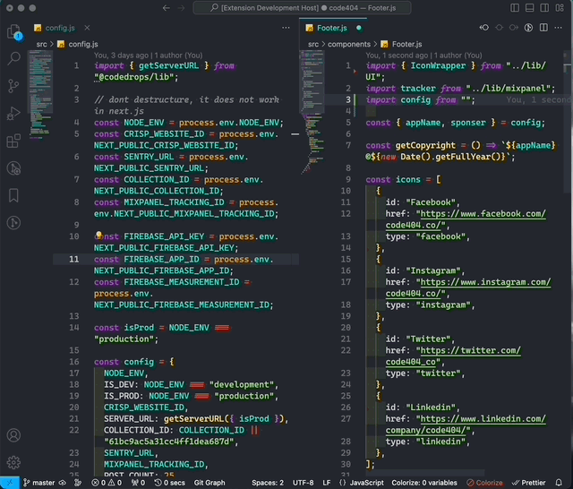
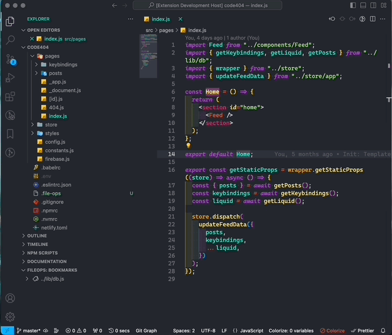
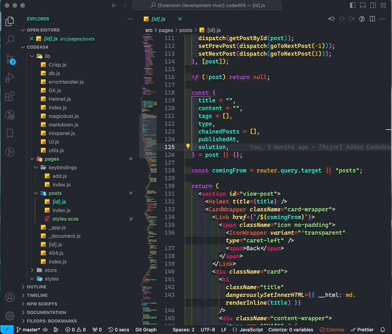
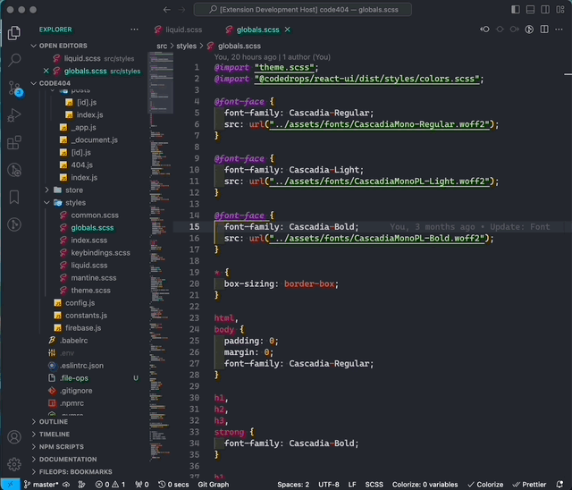
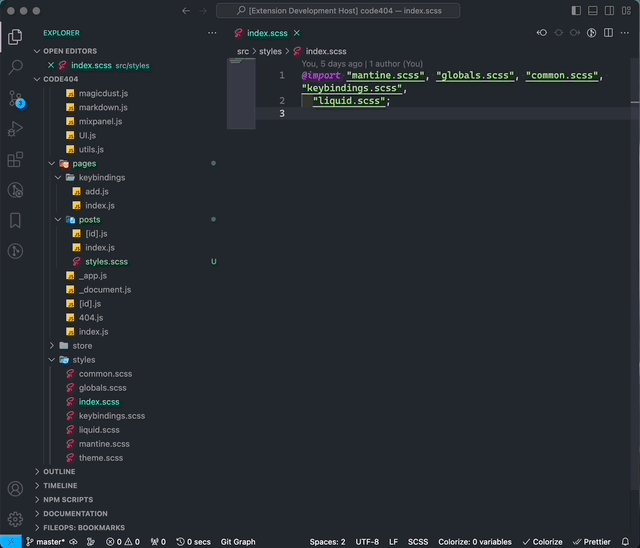
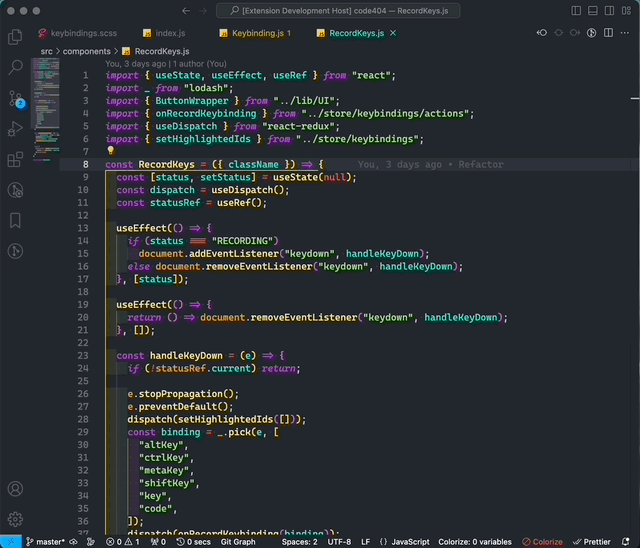
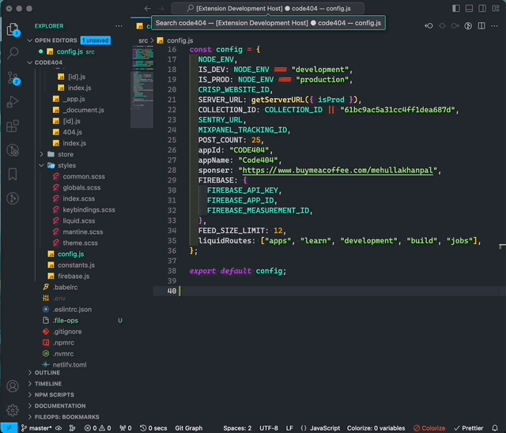
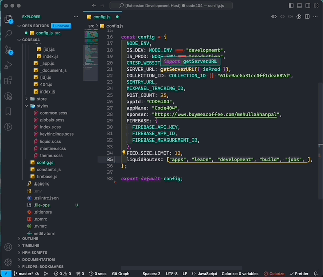
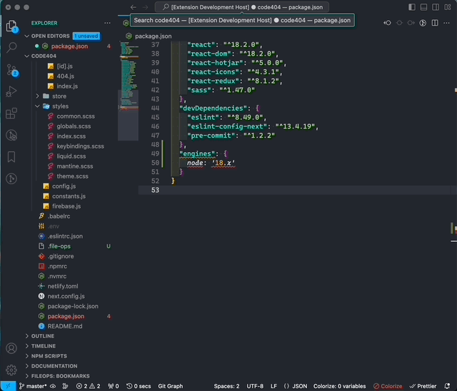
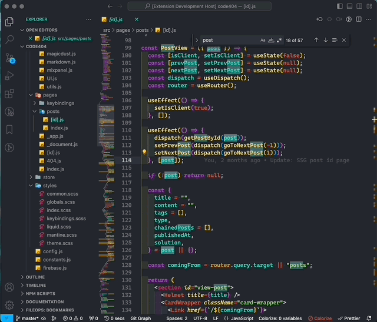

# File Ops

> VS Code extension to import, group, bookmark, quick switch files, text transformations & keyboard shortcuts.

## Overview

**1. File Import** - Paste relative path to imported files

**2. Bookmarks** - Bookmark files & easily access them

**3. Quick Switch** - Switch between file pairs. ex. switch between **.css** & **.js** from same folder using **`Ctrl/Cmd+E`**

**4. Related Files From Same Folder** - View files (except current file & folders) from the **current** folder & **switch** to them

**5. File Group** - Load/Save group of files

**6. Copy File Name** - Copy current file name using the command `FileOps: Copy Current File Name`

**7. Transform Text** - Hightlight & transform text using `FileOps: Text Transform`

**8. Stringify Text** - Hightlight & JSON.stringify() text using `FileOps: JSON.stringify`

**9. Toggle CaseSensitive & SearchWholeWord** - Toggle `CaseSensitive` & `SearchWholeWord` using the keyboard shortcut `Cmd+Option+E`

<!-- [Watch Demo](https://youtu.be/ze9KtYe3f48) -->

> Note: All extension data is stored in an auto generated file called `.file-tag`  
> Please do not make any changes to that file. If required, add it to `.gitignore`

## Features

### File Import

1. `FileOps (Import): Copy Current File Path`: Copy absolute path from command palette, context menu or use the shortcut `Cmd/Ctrl+Shift+C`
2. `FileOps (Import): Paste Relative File Path`: Paste the relative path using command palette, context menu or use the shortcut `Cmd/Ctrl+Shift+V`



### Bookmarks (Earlier File Tag)

- Create file bookmarks. open & view files using the bookmarks
  1. Open, View, Edit, Delete file bookmarks from the tree view, or
  2. Perform operations using the commands. Search for `FileOps (Bookmarks)` to get all commands



### Quick Switch

Quickly switch between file pairs. ex., Switch between `.css` & `.js` files from the same folder.

_Define custom pairs using the exposed setting (fileOps.fileSwitch.excludeFiles)_

**Note**: By default, `index.js` file is excluded so it wont be considered for switching

##### Example 1 - Switching between `.scss` & `js` file from same folder using the shortcut `Cmd/Ctrl+E`



##### Example 2 - Switching between custom files `liquid.scss` & `globals.scss` from same folder using the shortcut `Cmd/Ctrl+E`. Defined setting:

```json
{
  ...
  "fileOps.fileSwitch.quickSwitchPairs": ["globals.scss/liquid.scss"]
}
```



### Related Files From Same Folder

Show all files (except active file) from current folder using the shortcut `Cmd/Ctrl+Shift+E`



### File Group

- Save a group of files using `FileOps (Groups): Save File Group`
- Load the saved group of files using `FileOps (Groups): Load File Groups`



### Copy File Name

Copy current file name using the command `FileOps: Copy Current File Name` or from context menu



### Transform Text

Highlight text and perform the following text transformations using the command `FileOps: Text Transform`

- UPPERCASE
- lowercase
- kebab-case
- snake_case
- camelCase
- Capitalize
- Trim & Replace spaces with underscore
- Remove spaces



### Stringify Text

Highlight & JSON.stringify the text.

> Note: It will cause an error if the highlighted text contains extra characters. Highlight the exact text which can be stringified if passed to JSON.stringify() method.



### Toggle CaseSensitive & SearchWholeWord

Quickly toggle the CaseSensitive & SearchWholeWord using the keyboard shortcut `Cmd/Ctrl+Option/Alt+E`



## Shortcuts

| Feature                                                 | Shortcut                       | Description                                                                           |
| ------------------------------------------------------- | ------------------------------ | ------------------------------------------------------------------------------------- |
| FileOps (Switch): Quick Switch                          | `Cmd+E` / `Ctrl+E`             | Switch between file pairs. ex., switch between `.css` & `.js` file using the shortcut |
| FileOps (Switch): Show Other Files in Current Directory | `Cmd+Shift+E` / `Ctrl+Shift+E` | Show all files (except active file) from current folder                               |
| FileOps (Import): Copy Current File Path                | `Cmd+Shift+C` / `Ctrl+Shift+C` | Copy absolute path of current file                                                    |
| FileOps (Import): Paste Relative File Path              | `Cmd+Shift+V` / `Ctrl+Shift+V` | Paste relative path to the `copied file`                                              |

## Settings

| Setting                             | Default value                                          | Description                                                                                                              |
| ----------------------------------- | ------------------------------------------------------ | ------------------------------------------------------------------------------------------------------------------------ |
| fileOps.fileSwitch.quickSwitchPairs | `[".js,.ts/.css,.sass,.scss", ".js/.js", ".json/.md"]` | Define file pairs to enable switch between them.ex., `[".json/.md"]` will enable switching between `.json` & `.md` files |
| fileOps.fileSwitch.excludeFiles     | `["index.js"]`                                         | File names to be excluded from quick switch                                                                              |
| fileOps.fileImport.addQuotes        | `false`                                                | Wrap the relative path in double quotes                                                                                  |
| fileOps.fileImport.addFileExtension | `true`                                                 | Retain the file extension of relative path                                                                               |

## Other projects

1. [Dev Box](https://chrome.google.com/webstore/detail/devbox/moifkpmfincoglpljkonmgnfaeonlgmo?utm_source=file_ops&utm_medium=readme) - A UI for local storage
2. [Array Builder](https://www.arraybuilder.com?utm_source=file_ops&utm_medium=readme) - A free tool to visualize the output of array operations
3. [Code404](https://www.code404.co/?utm_source=file_ops&utm_medium=readme) - Micro-blogging on Web development

## Support

If you liked this extension consider supporting [here](https://www.buymeacoffee.com/mehullakhanpal)
