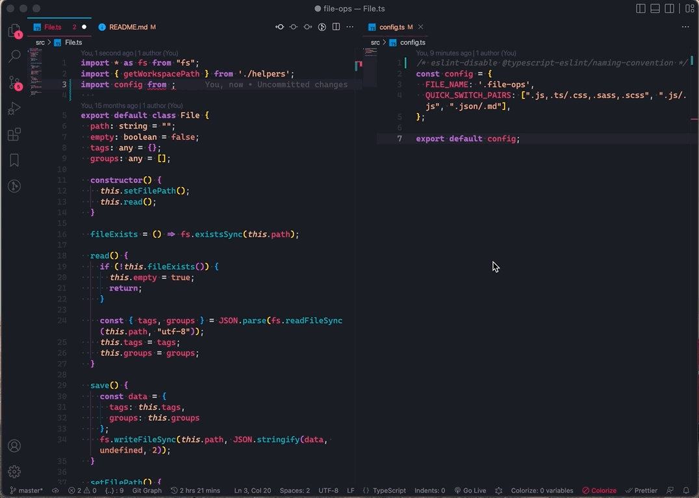

# File Ops

> VS Code extension to import, group, bookmark, quick switch files & more.

## Overview

**1. File Import** - Paste relative path to imported files

**2. Bookmarks** - Bookmark files & easily access them

**3. Quick Switch** - Switch between file pairs. ex. switch between **.css** & **.js** from same folder using **`Ctrl/Cmd+E`**

**4. Related Files from same folder** - View files (except current file & folders) from the **current** folder & **switch** to them

**5. File Group** - Load/Save group of files

**6. Copy File Name** - Copy current file name using the command `FileOps: Copy Current File Name`

**7. Transform Text** - Hightlight & transform text using `FileOps: Text Transform`

**8. Stringify Text** - Hightlight & JSON.stringify() text using `FileOps: JSON.stringify`

**9. Toggle CaseSensitive & SearchWholeWord** - Toggle `CaseSensitive` & `SearchWholeWord` using the keyboard shortcut `Cmd+Option+E`

[Watch Demo](https://youtu.be/ze9KtYe3f48)

## Features

### File Import

1. `FileOps: Copy Current File Path`: Copy absolute path from command menu or right click
2. `FileOps: Paste Relative File Path`: Paste the relative path using command menu or right click

### Bookmarks (Earlier File Tag)

- Create file aliases. open & view files using the aliases
  1. Open, View, Edit, Delete file tags from the tree view, or
  2. Perform operations using the commands. Search for `FileOps` to get all commands

> Note: All extension data is stored in an auto generated file called `.file-tag`  
> Please do not make any changes to that file. If required, add it to `.gitignore`

### Quick Switch

Quickly switch between file pairs. ex., Switch between `.css` & `.js` files from the same folder.

_Define custom pairs using the exposed setting (fileOps.fileSwitch.excludeFiles)_

**Note**: By default, `index.js` file is excluded so it wont be considered for switching

### Related Files

Show all files (except active file) from current folder

<!-- ## Commands

Run commands by opening Command Palette `Ctrl+Shift+P` / `Cmd+Shift+P`

 -->

## Shortcuts

| Feature                                                 | Shortcut                       | Description                                                                           |
| ------------------------------------------------------- | ------------------------------ | ------------------------------------------------------------------------------------- |
| FileOps (Switch): Quick Switch                          | `Cmd+E` / `Ctrl+E`             | Switch between file pairs. ex., switch between `.css` & `.js` file using the shortcut |
| FileOps (Switch): Show Other Files in Current Directory | `Cmd+Shift+E` / `Ctrl+Shift+E` | Show all files (except active file) from current folder                               |
| FileOps (Import): Copy Current File Path                | `Cmd+Shift+C` / `Ctrl+Shift+C` | Copy absolute path of current file                                                    |
| FileOps (Import): Paste Relative File Path              | `Cmd+Shift+V` / `Ctrl+Shift+V` | Paste relative path to the `copied file`                                              |

## Settings

| Setting                             | Default value                                          | Description                                                                                                              |
| ----------------------------------- | ------------------------------------------------------ | ------------------------------------------------------------------------------------------------------------------------ |
| fileOps.fileSwitch.quickSwitchPairs | `[".js,.ts/.css,.sass,.scss", ".js/.js", ".json/.md"]` | Define file pairs to enable switch between them.ex., `[".json/.md"]` will enable switching between `.json` & `.md` files |
| fileOps.fileSwitch.excludeFiles     | `["index.js"]`                                         | File names to be excluded from quick switch                                                                              |
| fileOps.fileImport.addQuotes        | `false`                                                | Wrap the relative path in double quotes                                                                                  |
| fileOps.fileImport.addFileExtension | `true`                                                 | Retain the file extension of relative path                                                                               |

## Other projects

1. [Dev Box](https://chrome.google.com/webstore/detail/devbox/moifkpmfincoglpljkonmgnfaeonlgmo?utm_source=file_ops&utm_medium=readme) - A UI for local storage
2. [Array Builder](https://www.arraybuilder.com?utm_source=file_ops&utm_medium=readme) - A free tool to visualize the output of array operations
3. [Fireboard](https://web.fireboardapp.com/?utm_source=file_ops&utm_medium=readme) - A work tracker for software developers
4. [Codedrops](https://codedrops.netlify.app/?utm_source=file_ops&utm_medium=readme) - Micro-blogging on Web development
5. [Octon](https://octon.netlify.com/?utm_source=file_ops&utm_medium=readme) - Manage expenses, todos, goals, progress & personal timeline
6. [Note Box](https://chrome.google.com/webstore/detail/note-box/mbbajjgefpenmkkhcnmmnoodlbcbfnmp?utm_source=file_ops&utm_medium=readme) - A chrome extension to add notes/todos based on URL
7. [Github Marker](https://chrome.google.com/webstore/detail/github-marker/imjdbnnpnohgcdbpgnidgolnamoghpoo?utm_source=file_ops&utm_medium=readme) - A chrome extension to Favorite, Bookmark & Mark link as Read in Github

## Support

If you liked this extension consider supporting [here](https://www.buymeacoffee.com/mehullakhanpal)
