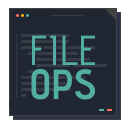

# File Ops

> Easily tag/alias files & quick switch between files.

## Features

### File Tag

- Create, Open, Edit, Delete file tags using commands.
- Open, View, Edit, Delete file tags from the tree view.

  

### File Switch

- #### Quick Switch:

  Quickly switch between extension pairs. ex., Switch between `.css` & `.js` files in the same folder. (Does not work for `index.js` file.)  
  _Extend the functionality by providing custom pairs._

  

- #### Related Files:

  View all the files from the current directory

  

> Note: All extension data is stored in a file named `.file-tag` which gets created in root workspace directory. Please do not make any changes to that file.  
> Add it to `.gitignore` based on the needs

## Keyboard Shortcuts

Quick Switch - `Command+E` / `Control+E`

Show related files & switch - `Command+Shift+E` / `Control+Shift+E`

## Extension Settings

This extension contributes the following settings:

- `fileOps.fileSwitch.quickSwitchPairs`: Array of **quick switch** pairs. ex., `[".js,.ts/.css,.scss"]`.

  Accepted regex: `/^(\.[a-z]+)(,(\.[a-z]+))*\/(\.[a-z]+)(,(\.[a-z]+))*$/`
