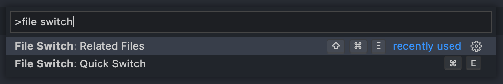

# File Ops

> Easily tag/alias files & quick switch between files.

## Overview

**1. File Tag** - **Tag/Alias/Bookmark** files

**2. Quick Switch** - Quickly switch between files. ex. Switch between **example.css** & **example.js** using **`Ctrl/Cmd+E`**

**3. Switch to Related Files** - View files from the _current_ directory and _switch_

[Watch Demo](https://youtu.be/ze9KtYe3f48)

## Features

### File Tag

- Create, Open, Edit, Delete file tags using commands.
- Open, View, Edit, Delete file tags from the tree view.

  

### Quick Switch

Quickly switch between extension pairs. ex., Switch between `.css` & `.js` files in the same folder.
_Extend the functionality by providing custom pairs._

### Related Files

View all the files from the current directory

> Note: All extension data is stored in a file named `.file-tag` which gets created in root workspace directory. Please do not make any changes to that file.  
> Add it to `.gitignore` based on the needs

## Commands

Run commands by opening Command Palette `Control+Shift+P` / `Command+Shift+P`

## Keyboard Shortcuts

Quick Switch - `Command+E` / `Control+E`

Show related files & switch - `Command+Shift+E` / `Control+Shift+E`

## Extension Settings

This extension contributes the following settings:

- `fileOps.fileSwitch.quickSwitchPairs`: Array of **quick switch** pairs. ex., `[".js,.ts/.css,.scss"]`.

  Accepted regex: `/^(\.[a-z]+)(,(\.[a-z]+))*\/(\.[a-z]+)(,(\.[a-z]+))*$/`

> Defined values for `quickSwitchPairs` in the extension is `[".js,.ts/.css,.sass,.scss", ".js/.js", ".json/.md"]`. Please create an issue for the defined pairs you require & it will be added in default value list.
